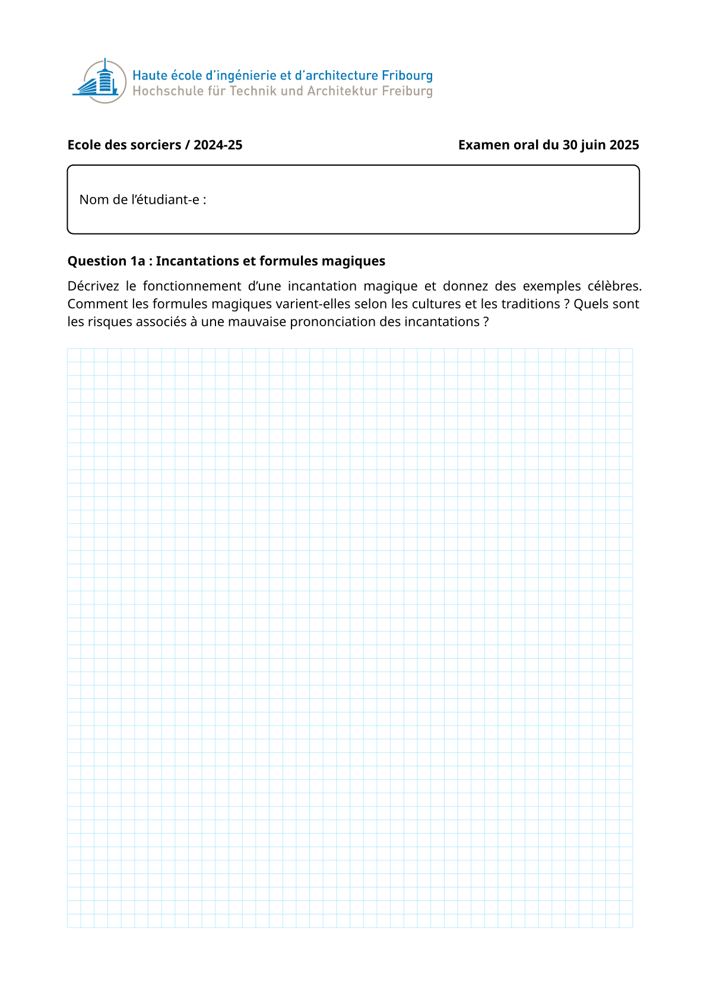

# Oral Exam Template

`hesso-oral-exam` is a [Typst](https://typst.app/) template for generating oral exam question sheets for HES-SO. It organises questions into numbered envelopes,
supports an optional solution mode, and renders a grid-lined answer space for students.

## Installation

This package is not yet published in the Typst _Universe_, but you can easily install it using the [`utpm`](https://github.com/typst-community/utpm) command line tool.

If you cloned this repository, install the package from the local path:

```bash
git clone https://github.com/hes-so/typst-oral-exam-questions.git
utpm pkg install typst-oral-exam-questions
```

Or install it directly from GitHub:

```bash
utpm pkg install https://github.com/hes-so/typst-oral-exam-questions.git
```

## Usage

### Initialise a new project

Use the Typst template to scaffold a new project:

```bash
typst init @local/hesso-oral-exam my-exam
cd my-exam
```

This creates the following structure:

```
main.typ          # entry point for the definition of questions
prof_sheets.typ   # entry point for the prof/expert document used during the exam (cover page + solutions)
questions.toml    # envelope / question mapping
students.toml     # exam schedule with distribution of envelopes to students (if known in advance)
img/              # logos and images
questions/        # one .typ file per question
```

### Define your questions

Each question lives in its own file under `questions/`. Use the `question` function:

```typst
#import "@local/hesso-oral-exam:0.2.0": question

#question(
  title: [Question title],
  author: "Teacher Name",
  [
    Question body text.
  ],
  solution: [
    Solution text shown only in solution mode.
  ],
)
```

### Map questions to envelopes

Edit `questions.toml` to group questions into envelopes. Each envelope has a number (`no`) and a list of question file names (without the `.typ` extension):

```toml
envelopes = [
    { no = 1, questions = ["topic_01", "lab_01"] },
    { no = 2, questions = ["topic_02", "lab_02"] },
]
```

### Define the exam schedule and map envelopes to students

If the envelopes are drawn in advance, a document can be generated for the teacher/expert
that includes a cover page to establish the grade and the solutions to the questions.
To do so, you must define the exam schedule and the drawn envelopes in the `students.toml` document.

```toml
students = [
  { name = "Jean Bolomey", arrival_time = "8:00", exam_time = "8:15", envelope = 1 },
  { name = "Joe Dalton", arrival_time = "8:15", exam_time = "8:30", envelope = 2 },
]
```

### Compile the exam

```bash
# Student version (no solutions)
typst compile main.typ

# Solution version
typst compile --input solution=true main.typ exam-solutions.pdf
```

## Template entry point

`main.typ` wires everything together via the `exam` function:

```typst
#import "@local/hesso-oral-exam:0.2.5": exam, exam-solution

#let data = toml("questions.toml")

#exam(
  name: [Course name / Year],
  date: [Oral exam date],
  logo: image(width: 110mm, "img/logo.svg"),
  envelopes: data.envelopes.map(l => (
    no: l.no,
    questions: l.questions.map(q => include "questions/" + str(q) + ".typ"),
  )),
)
```

### Compile the prof/expert sheets

```bash
# Sheets used during the exam with a cover page and the solution to questions
typst compile prof_sheets.typ
```

### `prof_sheets` entry point
The `prof_sheets.typ` file connects everything via the `my_exam` function.
Simply define the properties corresponding to your specific exam, such as `title` or `date`.

```typst
#import "@local/hesso-oral-exam:0.2.5": prof_evaluation_page
...
#let my_exam(
  student: none,
  preparation: none,
  passage: none,
  question1: none,
  question2: none,
) = {
  prof_evaluation_page(
    title: [MA_Embreal / 2025-26],
    date: [Examen oral du 23 juin 2026],
    version: role,
    student: student,
    class: [MA_EmbReal],
    teacher: [Serge Ayer/Luca Haab],
    expert: [Luca Haab/Serge Ayer],
    duration: [20 min.],
    preparation: preparation,
    passage: passage,
    question1: question1,
    question2: question2,
  )
}
...
```

## Package information

| Field   | Value                                     |
|---------|-------------------------------------------|
| Name    | `hesso-oral-exam`                         |
| Version | `0.2.5`                                   |
| License | MIT                                       |
| Author  | Jacques Supcik <jacques.supcik@hes-so.ch> |

## License

This project is licensed under the [MIT License](LICENSE).

## Example Output


